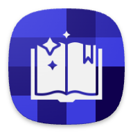
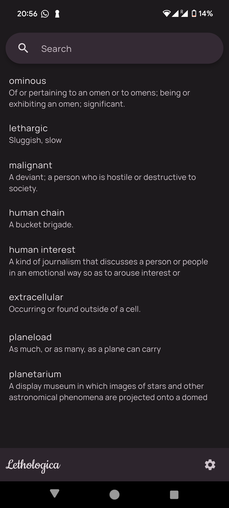
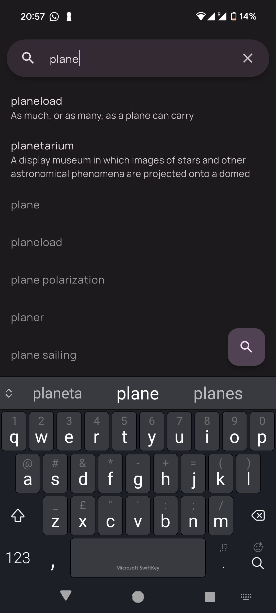
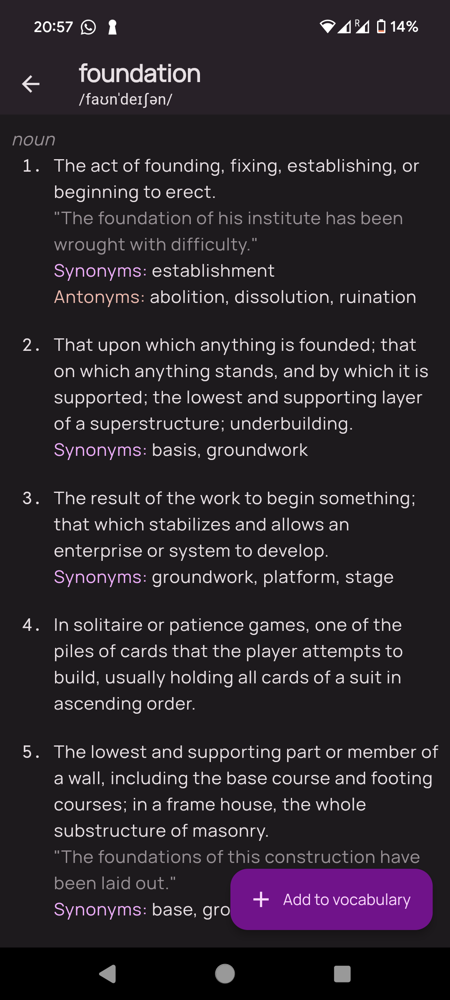

</img> 

# Lethologica
 

Look up words in the dictionary and save them into this easy-to-use, minimalistic vocabulary. 

  <table>
    <tr>
      <td style="text-align: center">
        
      </td>
      <td style="text-align: center">
        
      </td>
      <td style="text-align: center">
        
      </td>
    </tr>
  </table>

Lethologica is an easy-to-use, beautiful dictionary app that allows users to query and save words into a vocabulary list stored on their devices.

Featuring smart auto-suggestion, offline storage and Material 3-based theming, this project's conception came from the idea of how complicated most vocabulary apps are, and I wanted something that I could quickly open up while reading a book or studying.

The app uses a free dictionary API and imposes a clean, structured architecture that allows it to be expanded anytime.
